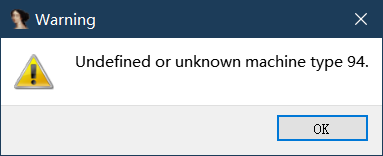

# ida plugin

Avoid warning `"Undefined or unknown machine type 94"` when IDA loading esp8266 bins.



## Build

Dependencies:
  * IDA 6.9 or higher or IDA 7.0 or higher with their respective SDKs installed
  * Linux/macOS: GCC/Clang with C++11 support
  * Windows: Visual Studio 2015 Compiler or Mingw 32-bit and Mingw 64-bit
  * CMake 3.7 or higher

### For IDA 7.0 or higher

1. Install vs2019
2. Add cmake to enviorment path
2. Run CMake to configure the build directory, replacing `<IDASDK>` with the
root path of your IDA SDK installation:

*Linux/macOS*:
```sh
mkdir -p build_for_70_and_higher
cd build_for_70_and_higher
cmake -S .. -D IdaSdk_ROOT_DIR=<IDASDK> -D CMAKE_BUILD_TYPE=Release
cmake --build .
```

*Windows use Visual Studio*:
```sh
mkdir build_for_70_and_higher
cd build_for_70_and_higher
cmake -S ..  -G "Visual Studio 16 2019" -D IdaSdk_ROOT_DIR=<IDASDK> -D CMAKE_BUILD_TYPE=Release
# Use command or Visual Studio build it.
cmake --build . --config Release
cmake --build . --config Debug
```

*Windows use Mingw*
```sh
set PATH=%PATH%;<MINGW-X64-DIR>/bin
mkdir build_for_70_and_higher
cd build_for_70_and_higher
cmake -S ..  -G "MinGW Makefiles" -D IdaSdk_ROOT_DIR=<IDA_SDK> -D CMAKE_BUILD_TYPE=Release
# Use command or Clion,CodeBlocks build it.
make
```

### For IDA 6.9 or lower

To configure for 32-bit IDA (IDA 6.95 or lower, or IDA 7.0 "old_x86"), use
the IDA 6.95 SDK and the following commands instead:

*Linux/macOS*:
```sh
mkdir -p build_for_69_and_lower
cd build_for_69_and_lower
cmake -S .. -D IdaSdk_ROOT_DIR=<IDASDK> -D CMAKE_BUILD_TYPE=Release -D BUILD_32BIT=ON
cmake --build
```

*Windows use Visual Studio*:
```sh
mkdir build_for_69_and_lower
cd build_for_69_and_lower
cmake -S .. -G "Visual Studio 16 2019" -D IdaSdk_ROOT_DIR=<IDASDK> -D BUILD_32BIT=ON
# Use command or Visual Studio build it.
cmake --build . --config Release
cmake --build . --config Debug
```

*Windows use Mingw*:
```sh
set PATH=%PATH%;<MINGW-X86-DIR>/bin
mkdir build_for_69_and_lower
cd build_for_69_and_lower
cmake -S .. -G "MinGW Makefiles" -D IdaSdk_ROOT_DIR=<IDASDK> -D BUILD_32BIT=ON
# Use command or Clion, CodeBlocks build it.
make
```

## Install

If all going well, depending on your configuration, the plugins now in the build directory:

| OS      | 64-bit build (IDA 7.0+) | 32-bit build (6.x or 7.x "old_x86") |
| ------- | -----------------------------  | ----------------------------------- |
| Linux   | `safe_load_xtensa_elf.so`      | `safe_load_xtensa_elf.plx`          |
|         | `safe_load_xtensa_elf.so`      | `safe_load_xtensa_elf.plx64`        |
| macOS   | `safe_load_xtensa_elf.dylib`   | `safe_load_xtensa_elf.pmc`          |
|         | `safe_load_xtensa_elf64.dylib` | `safe_load_xtensa_elf.pmc64`        |
| Windows | `safe_load_xtensa_elf.dll`     | `safe_load_xtensa_elf.plw`          |
|         | `safe_load_xtensa_elf64.dll`   | `safe_load_xtensa_elf.p64`          |

Finally, put the plugins into the `plugins` folder in your IDA Pro installation.
